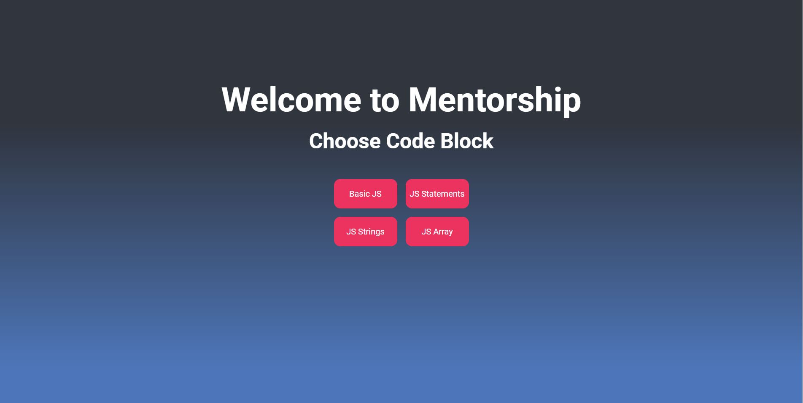
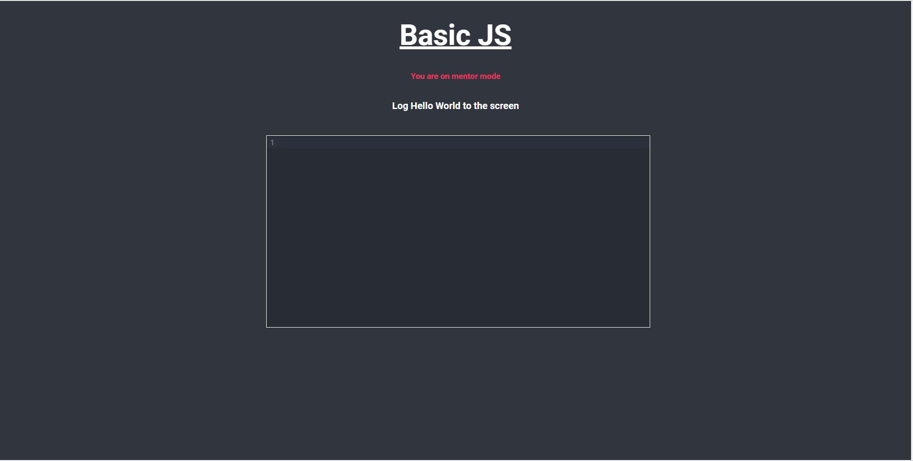

## Project Name & Pitch

Cody 

an online coding web application that allows a mentor to share and observe a code block in real-time with a student.
built with Mongo, Express, React and Node.js.

Features:

* The first user to enter a codeblock is the mentor, and subsequent users are students.
* The mentor can only read the code, not edit it.
* When a student enters the correct solution, fireworks will appear on their screen.

DEMO:

https://mentorship-y5pa.onrender.com/

## Project Screen Shot(s)
 

 
 
 
 
Lobby Screen : 
 
 

 
 
 
 
Codeblock Screen : 
 
 

## Installation and Setup Instructions

Clone down this repository. You will need `node` and `npm` installed globally on your machine.  

Installation:

`npm install`  

To Start Server:

`npm start`  

To Start Client:

`npm start`

To Visit App:

`localhost:3000`  
